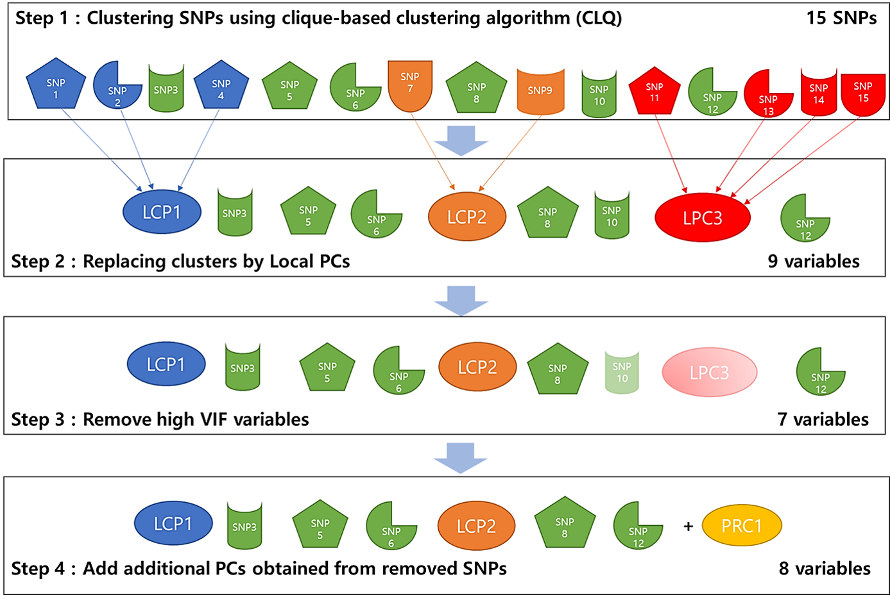

# Dimension Reduction using Local Principal Components for Regression-based Multi-SNP Analysis in 1000 Genomes and the Canadian Longitudinal Study on Aging (CLSA)
Dimension Reduction using Local Principal Components (DRLPC) is an approach for gene-level association analysis based on Local PCA. DRLPC enhances the power of multi-SNP test statistics while preserving localized effect interpretability. It clusters highly correlated SNPs, replaces each cluster with a local principal component, and iteratively removes variables with high Variance Inflation Factor (VIF) to address multi-collinearity before regression analysis.

Detailed information about [DRLPC: Dimension Reduction using Local Principal Components] can be found in our [preprint](https://www.biorxiv.org/content/10.1101/2024.05.13.593724v1.abstract).

## **Overviwe of DRLPC algorithm** ##

### **DRLPC algorithm** ###
Step 1: SNPs are clustered using the clique-based algorithm (CLQ).  
Step 2: Clusters are replaced by Local PCs.  
Step 3: Removed variables with high VIF in the updated dataset.  
Step 4: Add additional PCs obtained by the removed SNPs.

<div align="center">
    
</div>

## **Usage Instructions**

### **To use the DRLPC algorithm, follow these steps:**

### **1. Download Files**
- Download the **`example_DRLPC_run.R`** script (main example script) from the **root directory**.
- The core functions for the algorithm are provided in **`DRLPC_all_functions.R`**, located in the **`source/`** folder.

---

### **2. Prepare Input Data**
- Ensure the input files are correctly formatted and placed in the **`data/`** folder:
  - **`SNPinfo.rds`**: Contains SNP information, including IDs and positions.
  - **`genotype_data.rds`**: Genotype data for individuals and SNPs.
  - **`geneSNPinfo.rds`**: Mapping of genes to associated SNPs.

---

## **3. Source Core Functions**

To load the **DRLPC_all_functions.R** file, add the following line to your script:

```R
source("DRLPC/source/DRLPC_all_functions.R")


## **Citation**
If you use this repository, please cite:

**Dimension Reduction using Local Principal Components for Regression-based Multi-SNP Analysis in 1000 Genomes and the Canadian Longitudinal Study on Aging (CLSA)**.  
Yavartanoo, F., Brossard, M., Bull, S. B., Paterson, A. D., & Yoo, Y. J.  
DOI: [https://doi.org/10.1101/2024.05.13.593724v1](https://www.biorxiv.org/content/10.1101/2024.05.13.593724v1.abstract)

---

## **License**

This package is released under the [GNU General Public License (GPL) v3.0](https://www.gnu.org/licenses/gpl-3.0.en.html).


